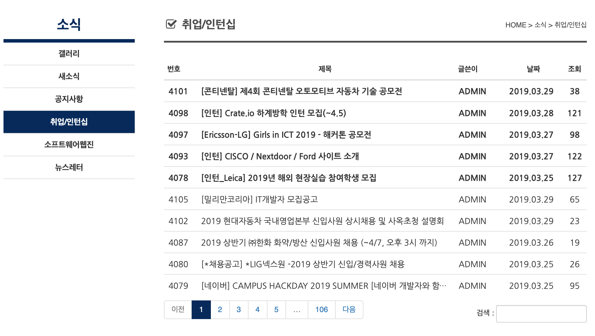
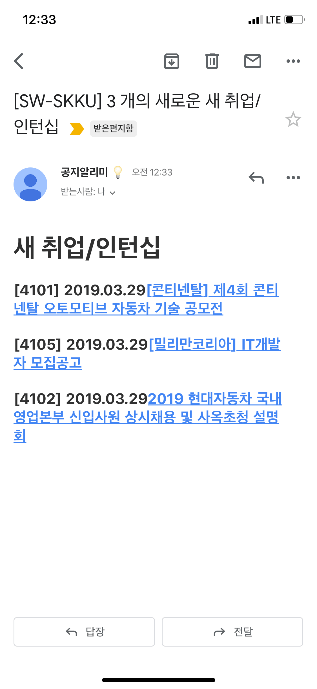

# Crawling & Notifier

- E-mail news notifier for [SKKU](https://skku.edu) [department of software](https://cs.skku.edu).

# Screenshots

# Module

Module is a crawling unit that does
- Crawling data & Check update
- Generate mail content

Each data from a module is sent as a **single E-Mail**

## Module Interface

Module should export following functions to be used by `index.js`

- `buildMailContent`
  - Generate mail content from the data obtained by `fetchData`
- `fetchData`
  - Crawling routine
- `prepare`
  - Any asynchronous preparation for module **must** be done inside this function.

# Requirements

- MongoDB Atlas
- G-Mail Account
